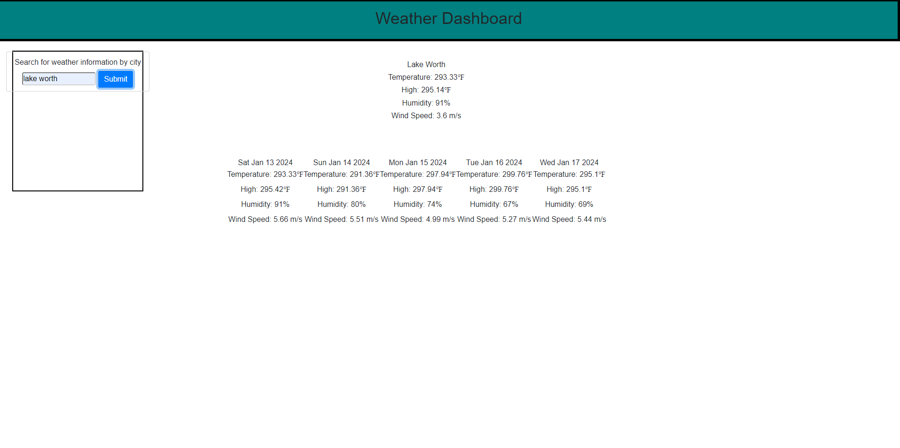

# Weather-2
Welcome to the OpenWeatherMap Weather API!

This is a simple weather forecast application that uses the OpenWeatherMap Weather API.

that pulls data from http://openweathermap.org/API and provides you with current weather conditions, 

https://zeusjr101.github.io/Weather-2/

